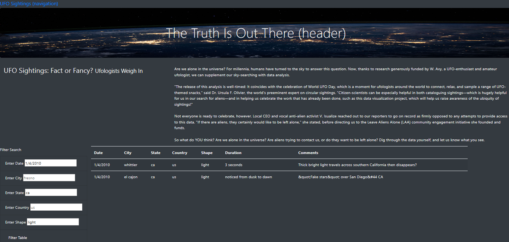

# UFOs
Create a web table to organize UFO data that is stored as a **JavaScript** array, or list.

## Steps
•	Describe **JavaScript** syntax and ideal use cases.  
•	Convert JavaScript functions to *arrow functions*.  
•	Build and deploy **forEach** (JavaScript for loop).  
•	Create, populate, and dynamically *filter* a table using JavaScript and **HTML**.  

## Discussion
Create additional filters for the webpage. The advanced filtering capability will allow users to filter the data by multiple factors. 

The codes are in [style.css](https://github.com/plin2204/UFOs/blob/master/style.css), [app.js](https://github.com/plin2204/UFOs/blob/master/app.js), and [index.html](https://github.com/plin2204/UFOs/blob/master/index.html).

One Recommendation for Fruther Development:  
For now, users have to press the button for filter. Besides that, perhaps it's a good idea to add "Press Enter" for filter as well.
